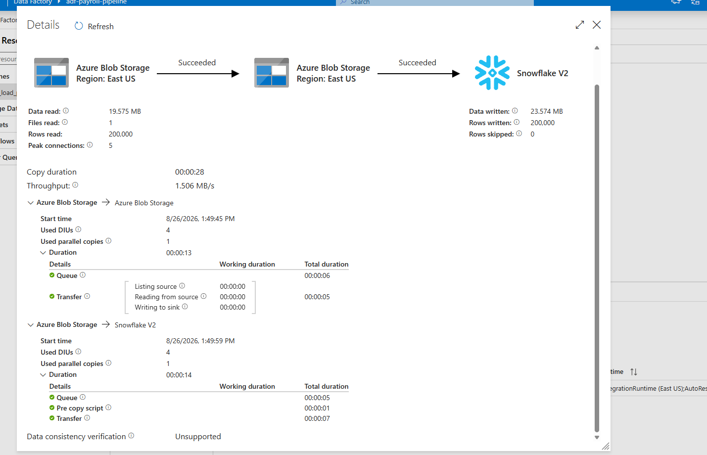
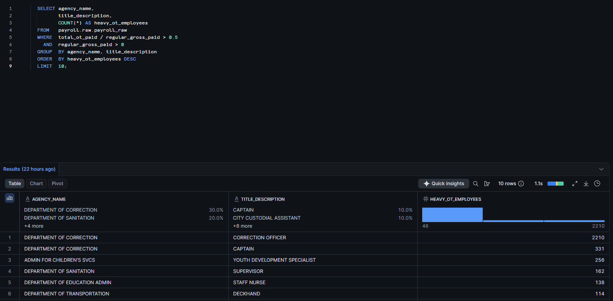

# NYC Payroll Overtime Analysis
Overtime is concentrated, not systemic. 2.6% of city employees drive it, and 43% of those are Correction Officers. 

An end-to-end ELT pipeline analyzing overtime spending across
New York City government agencies.

## Architecture

Python → Azure Blob Storage → Azure Data Factory → Snowflake → SQL

- **Python** extracts from the NYC Open Data API, filters to FY2024,
  and trims 17 columns to 10
- **Azure Blob Storage** holds the raw file
- **Azure Data Factory** copies it into Snowflake via a staged COPY INTO
- **Snowflake** stores the raw layer and runs the analytics SQL

*200,000 rows loaded from Blob Storage into Snowflake, 0 skipped.*
**Note** For this single file, Python could load directly to snowflake. Data Factory is included for my personal exposure to the software.

200,000 records across 73 agencies.

## The question

City finance departments struggle to answer basic questions about
overtime spending. Overtime concentrated in a few individuals is a
scheduling problem; overtime spread across a job title is a staffing
problem. They require different fixes.

## Findings

### Agency-level overtime

Ranked 25 agencies with 500+ employees by overtime as a share of
regular payroll.

Top three:
1. Department of Correction — 41.81%
2. Board of Election — 24.08%
3. Department of Transportation — 19.54%

Correction and Transportation fit the pattern of 24/7 operations where work can't be deferred. Board of Election is different because it's a seasonal
surge around elections rather than structural understaffing. Similar number, opposite cause, opposite fix.

### Job titles
Top three:
1. Captain - 57.22%
2. WARDEN-ASSISTANT DEPUTY WARDEN TED < 11/1/92 - 53.70%
3. Deckhand - 53.70%

Captain and Warden are both supervisor roles, which explains where the 41.81% in Department of Correction comes from. 
Deckhand is transportation, that runs 24/7 in NYC and is on a fixed schedule so someone always needs to be running it no matter who calls out. 

### Individual concentration
About 2.67% (5,109 people) earn more than half of their regular pay again in overtime. Correction Officer has about 2,210 heavy overtime earners. Thats 43% of all 5,109 across the city. Captain adds 331 and Warden adds 46. Correction accounts for half the city's heavy overtime population. 

Worth noting that the title with the highest overtime ratio (Captain, 57.22%) is not the title with the most heavy overtime earners, thats (Correction Officer, 2,210). Ration finds the most extreme cases and count finds where the money is. 

## Data quality notes

`base_salary` is not comparable across records — `pay_basis` varies between per Annum, per Hour, per Day, and Prorated Annual. The analysis uses actual dollars paid instead.

## Repo structure

- `extract_payroll.py` — API extract and column trim
- `sql/01_setup.sql` — Snowflake schema
- `sql/02_agency_overtime.sql` — agency-level analysis
- `sql/03_title_overtime.sql` — job title analysis
- `sql/04_heavy_overtimeemp.sql` — individual concentration
- `docs/` — pipeline screenshots